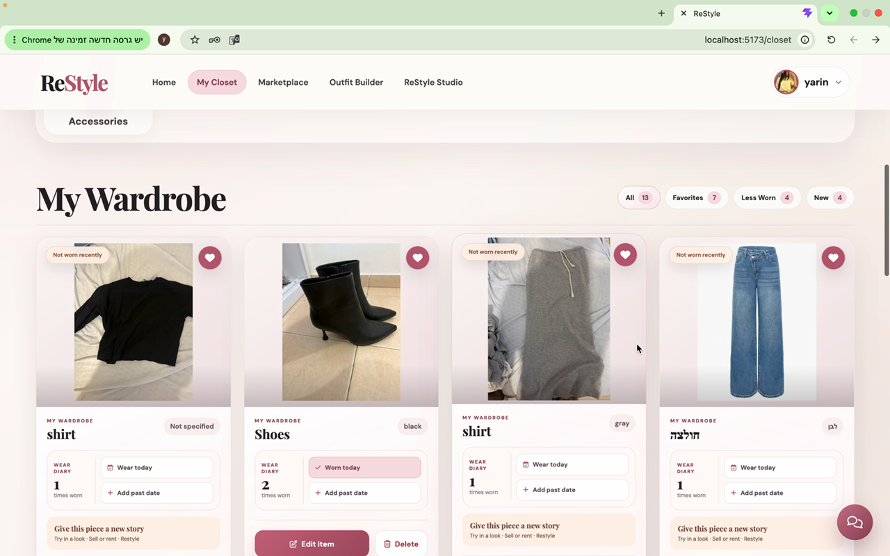
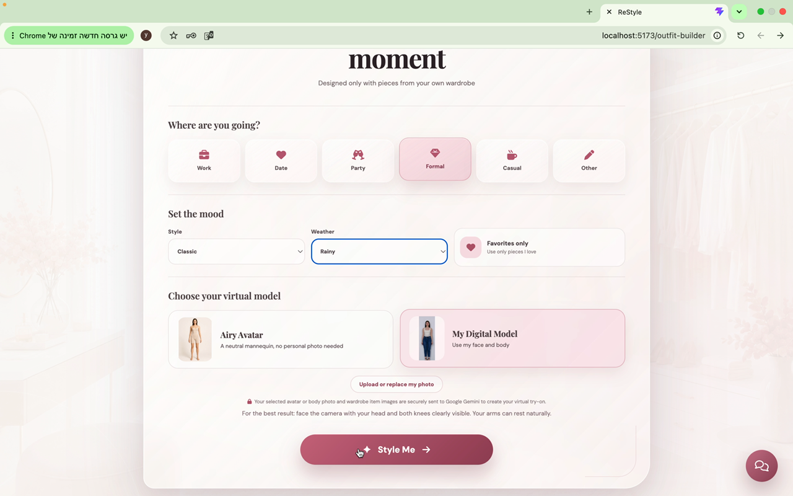
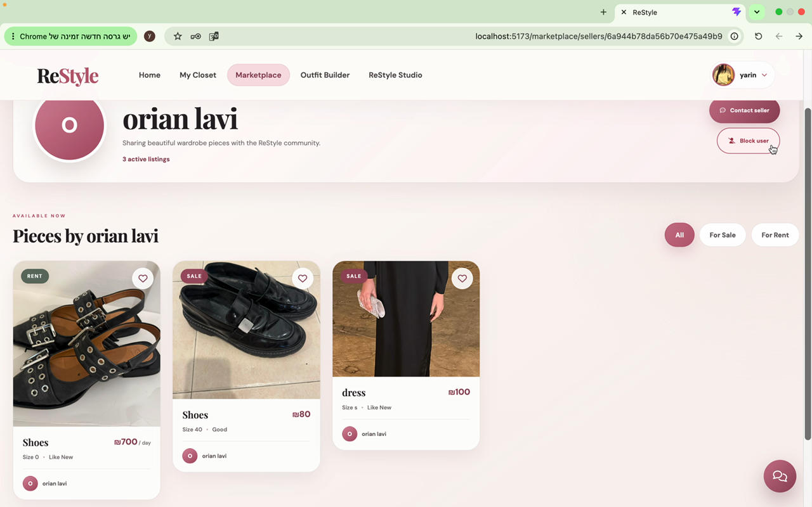
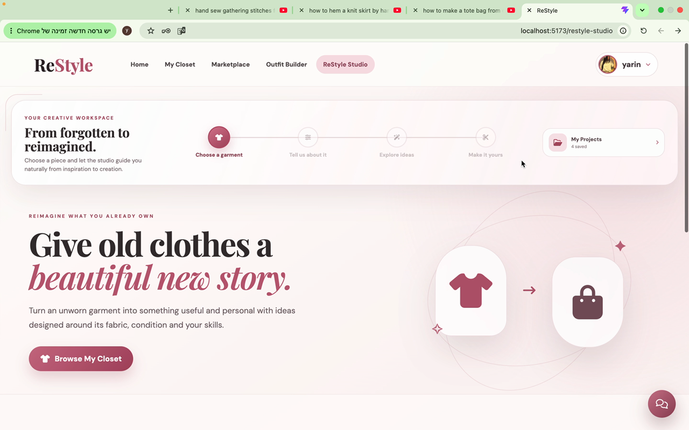
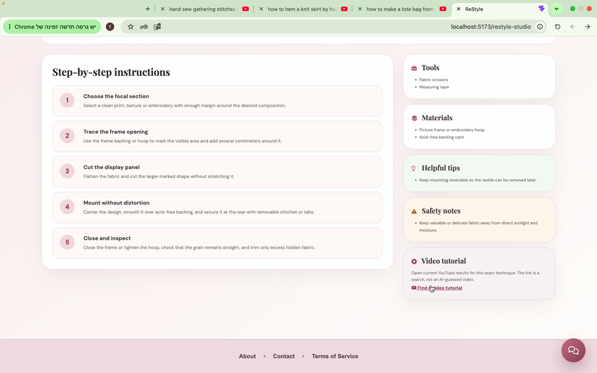

# ReStyle

ReStyle is a full-stack smart wardrobe platform for managing personal clothing, building AI-assisted outfits, creating virtual try-on images, redesigning existing garments, and exchanging fashion items through a community marketplace.

The project is built as a React single-page application backed by a secure Node.js REST API and MongoDB database.

## Main features

- Email/password and Google authentication
- Access and refresh token flow with protected client and server routes
- Personal wardrobe CRUD with image uploads, favorites, and wear history
- AI outfit generation based on event, style, weather, and wardrobe images
- Personal-model and preset-avatar virtual try-on
- Saved outfit management
- ReStyle Studio for AI garment redesign ideas and project history
- Marketplace listings, seller profiles, favorites, and availability management
- Real-time marketplace messaging with Socket.IO
- PayPal Sandbox checkout for plans and try-on credits
- Responsive loading, empty, error, 404, and global crash states

## Tech stack

### Frontend

- React 19 and Vite
- React Router
- Context API for authentication
- Redux Toolkit for marketplace favorites
- Axios
- Socket.IO Client
- Lazy-loaded pages and memoized reusable components

### Backend

- Node.js, Express 5, and TypeScript
- MongoDB and Mongoose
- Joi request validation
- JWT and bcrypt authentication
- Multer and Sharp image processing
- Helmet, CORS, and rate limiting
- Socket.IO
- Google Gemini APIs
- Google Identity Services
- PayPal REST API
- Nodemailer

## Architecture

The backend follows an MVC-oriented structure with additional service and validation layers:

```text
backend/src/
├── controllers/   HTTP request and response handling
├── middleware/    authentication, validation, uploads, and rate limits
├── models/        Mongoose schemas and collection relationships
├── routes/        endpoint definitions and middleware chains
├── services/      business logic and external integrations
├── validation/    Joi schemas
├── app.ts         Express configuration
└── server.ts      database connection and HTTP/Socket.IO startup
```

The frontend separates pages, reusable components, authentication context, Redux state, hooks, and API configuration:

```text
frontend/src/
├── components/
├── context/
├── hooks/
├── pages/
├── store/
├── config/
└── App.jsx
```

## Requirements

- Node.js 20 or newer
- npm
- A MongoDB database, local or MongoDB Atlas
- Service credentials only for the optional integrations you want to run

## Local setup

1. Clone the repository:

   ```bash
   git clone https://github.com/yarinreuven/ReStyleProject.git
   cd ReStyleProject
   ```

2. Install backend dependencies:

   ```bash
   cd backend
   npm install
   cp .env.example .env
   ```

3. Fill in the required values in `backend/.env`. At minimum, local authentication requires `MONGO_URI`, `JWT_SECRET`, and `FRONTEND_URL`.

4. Start the backend:

   ```bash
   npm run dev
   ```

5. In a second terminal, install frontend dependencies:

   ```bash
   cd frontend
   npm install
   cp .env.example .env
   ```

6. For local development, set the frontend API URL:

   ```env
   VITE_API_URL=http://localhost:3001/api
   ```

7. Start the frontend:

   ```bash
   npm run dev
   ```

8. Open `http://localhost:5173`.

## Environment variables

Never commit real credentials. The repository includes safe example files at `backend/.env.example` and `frontend/.env.example`.

### Backend

| Variable | Purpose |
| --- | --- |
| `MONGO_URI` | MongoDB connection string |
| `PORT` | Backend HTTP port; the local example uses `3001` |
| `JWT_SECRET` | Secret used to sign authentication tokens |
| `FRONTEND_URL` | Allowed frontend origin and link base |
| `LOG_LEVEL` | Server log verbosity, such as `info` in production |
| `APP_TIME_ZONE` | Time zone used for wear-history dates; defaults to `Asia/Jerusalem` |
| `SMTP_HOST`, `SMTP_PORT`, `SMTP_USER`, `SMTP_PASS` | Password-reset and account email delivery |
| `EMAIL_FROM`, `SUPPORT_EMAIL` | Sender and public support addresses |
| `GOOGLE_CLIENT_ID` | Google OAuth web client ID |
| `GEMINI_API_KEY` | Outfit generation and virtual try-on integration |
| `GEMINI_RESTYLE_API_KEY` | Separate ReStyle Studio AI integration |
| `PAYPAL_ENV` | PayPal environment, normally `sandbox` during development |
| `PAYPAL_CLIENT_ID`, `PAYPAL_CLIENT_SECRET` | Server-side PayPal credentials |
| `PAYPAL_WEBHOOK_ID` | PayPal webhook verification ID |

Development-only AI mock and integration-test flags are intentionally excluded from production setup.

### Frontend

| Variable | Purpose |
| --- | --- |
| `VITE_API_URL` | Base URL of the backend API |
| `VITE_GOOGLE_CLIENT_ID` | Google OAuth web client ID used by the browser |

## API overview

All routes are prefixed with `/api`. Protected resources require an access token. Refresh and logout use the secure refresh-token cookie.

A ready-to-import Postman collection is available at [`postman/ReStyle.postman_collection.json`](postman/ReStyle.postman_collection.json). Set its collection variables, run the login request to store an access token, and replace example resource IDs with IDs returned by your local database.

| Area | Method and endpoint | Purpose |
| --- | --- | --- |
| Authentication | `POST /auth/register` | Create an account, optionally with a profile image |
| Authentication | `POST /auth/login` | Sign in with email and password |
| Authentication | `POST /auth/google` | Sign in with Google |
| Authentication | `POST /auth/refresh` | Refresh an access token |
| Authentication | `POST /auth/logout` | End the current refresh session |
| Authentication | `GET/PUT/DELETE /auth/me` | Read, update, or delete the current account |
| Authentication | `POST /auth/forgot-password` | Request a password-reset email |
| Authentication | `POST /auth/reset-password` | Reset a password with a valid token |
| Wardrobe | `GET /items` | List the authenticated user's wardrobe |
| Wardrobe | `POST /items` | Create an item with an uploaded image |
| Wardrobe | `PUT /items/:id` | Update an owned item |
| Wardrobe | `DELETE /items/:id` | Delete an owned item |
| Outfits | `POST /outfits/generate` | Generate and validate a wardrobe-only outfit |
| Outfits | `POST /outfits/try-on` | Create a virtual try-on image |
| Outfits | `GET /outfits/try-on/status` | Read the user's try-on allowance |
| Outfits | `GET/POST /outfits/saved` | List or save outfits |
| Marketplace | `GET/POST /marketplace` | Browse or create listings |
| Marketplace | `GET/PUT/DELETE /marketplace/:id` | Read, update, or delete a listing |
| Favorites | `GET/POST/DELETE /marketplace-favorites` | Manage marketplace favorites |
| Messages | `GET/POST /messages/conversations` | List or start conversations |
| Messages | `POST /messages/conversations/:id/messages` | Send a message |
| ReStyle Studio | `GET/POST /restyle-projects` | List or create redesign projects |
| ReStyle Studio | `POST /restyle-projects/:id/ideas` | Generate redesign ideas |
| PayPal | `GET /paypal/config` | Return safe browser checkout configuration |
| PayPal | `POST /paypal/orders` | Create an order |
| PayPal | `POST /paypal/orders/:orderId/capture` | Capture an approved order |
| PayPal | `POST /paypal/webhook` | Process verified PayPal events |

## Validation and security

- Passwords are hashed with bcrypt and excluded from normal model queries.
- JWT-protected endpoints verify the authenticated user.
- Refresh tokens are stored as hashed, revocable sessions.
- Joi validates request bodies and route parameters.
- Mongoose schemas provide database-level constraints and relationships.
- Helmet security headers, restricted CORS, global and per-user rate limits are enabled.
- Uploaded images are limited by type and size and are processed before use.
- Global backend error middleware returns safe responses without production stack traces.
- A React Error Boundary prevents unhandled rendering failures from leaving a blank page.
- Secrets belong only in ignored `.env` files and hosting-platform environment settings.

## Quality checks

Run the backend checks:

```bash
cd backend
npm run typecheck
npm test
```

Run the frontend checks and production build:

```bash
cd frontend
npm run lint
npm test
npm run build
```

The MongoDB integration test is opt-in and requires a dedicated test database. Do not point it at development or production data.

## Demo video

[Watch the complete ReStyle project walkthrough](docs/demo/restyle-project-demo.mp4)

The 18-minute recording demonstrates the main user flows: authentication, wardrobe management, outfit generation and virtual try-on, marketplace actions, messaging, ReStyle Studio, validation, and responsive UI states.

## Screenshots

### My Closet



### Outfit Builder



### Marketplace



### ReStyle Studio



### ReStyle project guide



## Deployment

The production deployment follows the course requirements: the React client is hosted on Vercel, the Node.js API and Socket.IO server are hosted on Heroku, and MongoDB Atlas provides the managed database. Production secrets are configured only in the hosting providers and are never committed to the repository.

- Client: Vercel production deployment of the Vite application
- Server: Heroku deployment of the Express API and Socket.IO service
- Database: MongoDB Atlas
- Configuration: `VITE_API_URL`, `FRONTEND_URL`, and all database and integration credentials are supplied through cloud environment variables

The live URLs will be added here immediately after the hosting providers finish provisioning the services.

## Author

Yarin Reuven — full-stack development, product design, backend architecture, frontend implementation, AI integrations, and testing.

## Project status

The application is feature-complete and prepared for final cloud deployment. Automated checks, documentation, screenshots, and the complete project demonstration are included in the repository.
